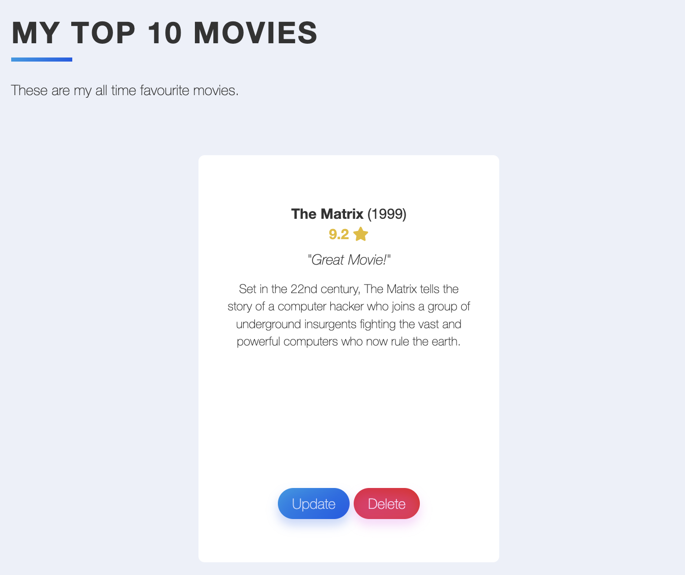

# Movie Ranking

This is a web application for tracking and ranking movies. You can add movies to your collection, rate them, and write reviews. The application utilizes the Flask framework, SQLAlchemy for database management, and the TMDB API for fetching movie details.

   

## Features

- View a list of movies in your collection, ordered by rating
- Rate movies on a scale of 1 to 10
- Write reviews for movies
- Add new movies to your collection by searching through the TMDB database
- Edit movie details, such as rating and review
- Delete movies from your collection

## Installation

1. Clone the repository to your local machine.
2. Install the required dependencies using pip:

```bash
pip install -r requirements.txt
```

3. Set up the environment variables:
   - `TMDB_API_KEY`: Your TMDB API key. You can obtain one by creating an account on the TMDB website.
4. Run the application:

```bash
python main.py
```

5. Access the application in your web browser at `http://localhost:5000`.

## Usage

- Homepage: The homepage displays the list of movies in your collection, ordered by rating. You can see the movie title, year, description, and rating. Movies are automatically ranked based on their rating.
- Add Movie: Click on the "Add Movie" button to add a new movie to your collection. Enter the title of the movie, and the application will search the TMDB database for matching movies. Select the desired movie from the search results to add it to your collection.
- Edit Movie: Click on a movie's title to edit its details. You can update the rating and write a review for the movie.
- Delete Movie: Click on the "Delete" button next to a movie to remove it from your collection.

🎇 Enjoy it!
